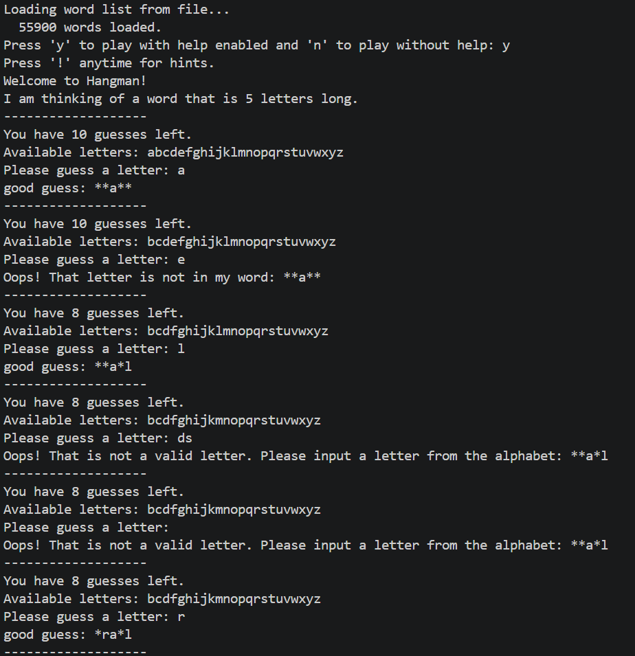
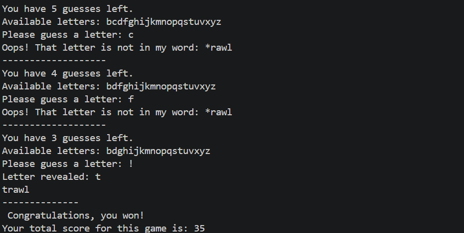

# Hangman — Terminal Word Guessing Game
## A classic Hangman game playable entirely in the terminal, built in Python. Players we Guess letters one at a time, manage limited guesses, use hints at a cost, and score points based on how efficiently you crack the word.

### ✨ Features/gameplay
- **Random word selection** from a massive wordlist of 55,000+ words
- **Hint system** — press `!` anytime to reveal an unrevealed letter hint (costs 3 guesses)
- **penalty** — wrong vowel guesses cost 2 guesses, consonants cost 1
- **Live progress display** — get word progress after every guess
- **Available letters tracker** — never lose track of what you've already tried
- **Scoring system** — Score is based on remaining guesses, unique letters, and word length.

### 🎯 Key Learning
- Ability to design and structure clean functions
- Working with file input and word lists
- Using **pytest** for error detection and testing
 - Applying the **random** and **string libraries** for dynamic behavior

### 🛠️ tools/libraries used - python , random , string , pytest suite for unit testing. 

-------------

### 📽️ Demo Gameplay-

-------

### 🎓 Inspiration & Credits

This project was based on MIT 6.100L Problem Set 2 and uses the course-provided word list. I implemented the gameplay, hint system, scoring, and tests as a Python learning exercise.
---

### 📄 License
This project is licensed under the MIT License.
